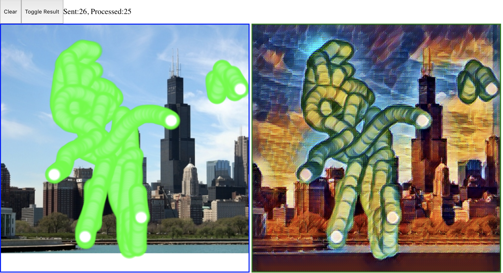

# neural-style-paint-demo

A sample app for Learn Teach Code that lets users paint on a collaborative canvas in real time over a WebSocket connection. Built with NodeJS, Express and SocketIO.

Draw on the left panel, and see the result on the right! there is about 2 seconds of latency if you're doing it on a computer with no CPU. Which is... not bad!



# Setup w/ Google Cloud
Setting up a VM is hard if you're doing it for the first time. Google has a sort-of-good documentation [here](https://cloud.google.com/deep-learning-vm/docs/quickstart-marketplace), which gets you a VM with Tensorflow already installed.

Install `gcloud` if you haven't already! Once you have a server:

### 1. ssh to your instance
The app serves the webpage on `localhost:5000`. In order to access it, you need to do port-forwarding, via something like this (copy the SSH that google gives you, but add the "-- -L 5000:localhost:5000" at the end):
```
gcloud compute ssh --project carbide-sweep-173716 --zone us-east1-c tensorflow-3-vm -- -L 5000:localhost:5000
```

### 2. clone + install
git clone the project

install flask (Note: you *have* to use `pip3`! Otherwise flask will complain)
```
pip3 install -r requirements.txt
```

get the checkpoints from somewhere (google cloud?) and put them in the directory
```
cd socketio-paint-demo
mkdir checkpoints
gsutil cp gs://transformer-results-bucket/training/fast_style_transfer-1/* checkpoints
```

run the webserver
```
FLASK_APP=app.py flask run
```

And after that, you should be able to see the webpage on `localhost:5000`! (since you did the port forwarding step in the beginning)

### 3. Hack on the code
You can change it if you want!


# Todo!!

## multiple users making style requests 
So right now, the webpage keeps track of the server ack (the # of images that have been processed so far) as a way to not spam the server too much. However, if multiple users connect and send "image" data with *different image_id's* (and this does happen, because the `image_id`'s are not tied to each other in any way), then the whole synchronization thing can be messed up!!
- find a good way to solve this

## making the network faster
This would mean more real-time feels. <3 How do we do this???? Run on a GPU
Right now, it's 1.7s on a CPU.

## making the network better
It doesn't look *great*, as to be expected. We took an image style thing, and *did absolutely no customization* to make it process sketches. A more sketch-aware solution would do wonders on this front!!
