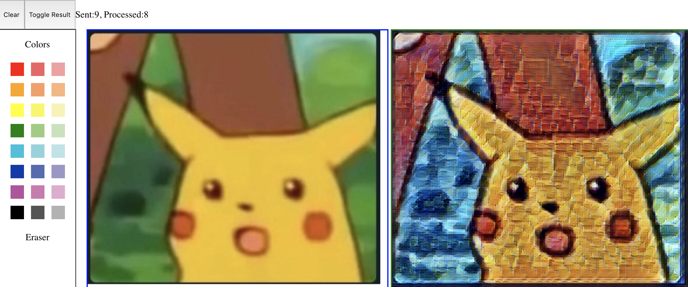

# MagicBrush

A sample app for Learn Teach Code that lets users paint on a collaborative canvas in real time over a WebSocket connection. Built with NodeJS, Express and SocketIO.

Draw on the left panel, and see the result on the right! there is about 2 seconds of latency if you're doing it on a computer with no CPU. Which is... not bad!



# Set up a Virtual Machine on Google Cloud Platform
We used a VM on GCP to train and run this project. To ensure that you have the same experience, you can set up your own VM to be similar to ours. Setting up a VM is hard if you're doing it for the first time. Google has a sort-of-good documentation [here](https://cloud.google.com/deep-learning-vm/docs/quickstart-marketplace), which gets you a VM with Tensorflow already installed.

### 1. Create a GCP project


### 2. Create a VM based on Deep Learning VM

From the main menu, under "Compute", choose "Compute Engine" then "VM instances".


Click on "Create Instance" from the top bar, then choose "Marketplace" from the left bar.


Search for and choose "Deep Learning VM". Click "Launch on Compute Engine".


Configure the VM as below, then click "Deploy".


Wait for a minute or two, then you will have your VM ready!

### 3. Set up Cloud SDK

The Cloud SDK (`gcloud`) is the preferred command line tool for interfacing with your instance. [Download it here.](https://cloud.google.com/sdk/install)

### 4. Create an SSH connection to your machine

From the main menu, under "Tools", choose "Deployment Manager" then "Deploy". Note that you can pin this category for quick access.


Click on your VM instance, then under "Suggested next steps" on the right bar, copy the command line to SSH into the VM and forward port 8080 on the VM to port 8080 on your local machine. Modify the command so that it forward port 5000 on the VM to port 5000 on your local machine instead (because we are using a Flask app, which by default runs on port 5000 in development). Run that command line.


Congratulations! Your GCP VM is now ready.

# Train and run the program on your GCP VM

Once you SSH'ed into your GCP VM:

### 1. `git clone` the project

### 2. Install all requirements
Note: You *have* to use `pip3`! Otherwise flask will complain.
```
pip3 install -r MagicBrush/requirements.txt
```

### 3. Get our training checkpoints
Get our training checkpoints from Google Cloud and put them in the directory.
```
cd MagicBrush
mkdir checkpoints
gsutil cp gs://transformer-results-bucket/training/fast_style_transfer-1/* checkpoints
```
### 4. Run the webserver
```
FLASK_APP=app.py flask run
```

### 5. Play with the app
You should be able to see MagicBrush at `localhost:5000`!

# Todo

## Multiple users making style requests
Right now, the webpage keeps track of the server ack (the # of images that have been processed so far) as a way to not spam the server too much. However, if multiple users connect and send "image" data with *different image_id's* (and this does happen, because the `image_id`'s are not tied to each other in any way), then the whole synchronization thing can be messed up!!
- find a good way to solve this

## Making the network faster
This would mean more real-time feels. <3 How do we do this???? Run on a GPU
Right now, it's 1.7s on a CPU.

## Making the network better
It doesn't look *great*, as to be expected. We took an image style thing, and *did absolutely no customization* to make it process sketches. A more sketch-aware solution would do wonders on this front!!
